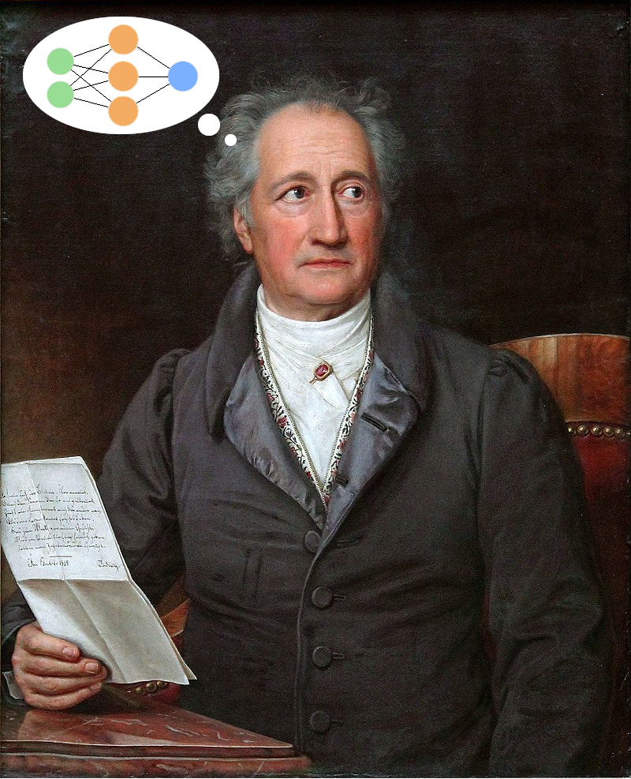

# Deep Learning and Digital Humanities (20-00-1080-se Deep Learning und Digital Humanities)

### Overview

The focus of the seminar is on humanities applications like poetry generation and analysis, metaphor and emotion identification, etc., and how to solve these problems with Deep Learning. Students will read papers and present them during the seminar. 

Der Fokus des Seminars wird auf Humanities Anwendungen wie Gedicht-Generierung und Analyse, Metaphern- und Emotions-Identifikation, etc. liegen, und wie diese mithilfe von Deep Learning gelöst werden können. Die Studenten werden Paper lesen und diese während des Seminars präsentieren.

{:height="36px" width="36px"}

### Previous and current material

* [2020](README_2020.md)
* [2019](README_2019.md)
